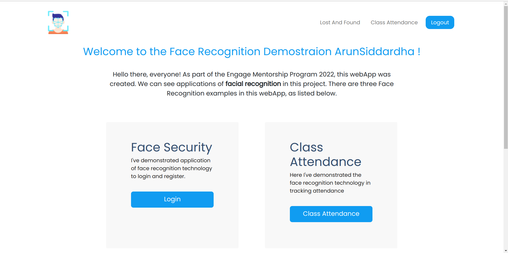
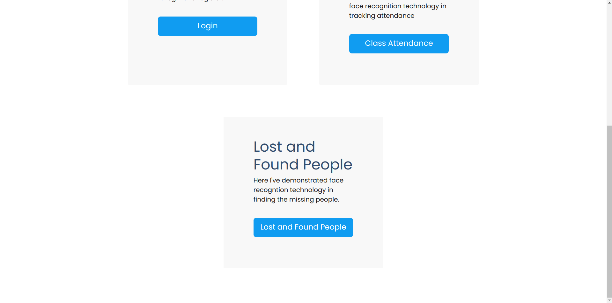
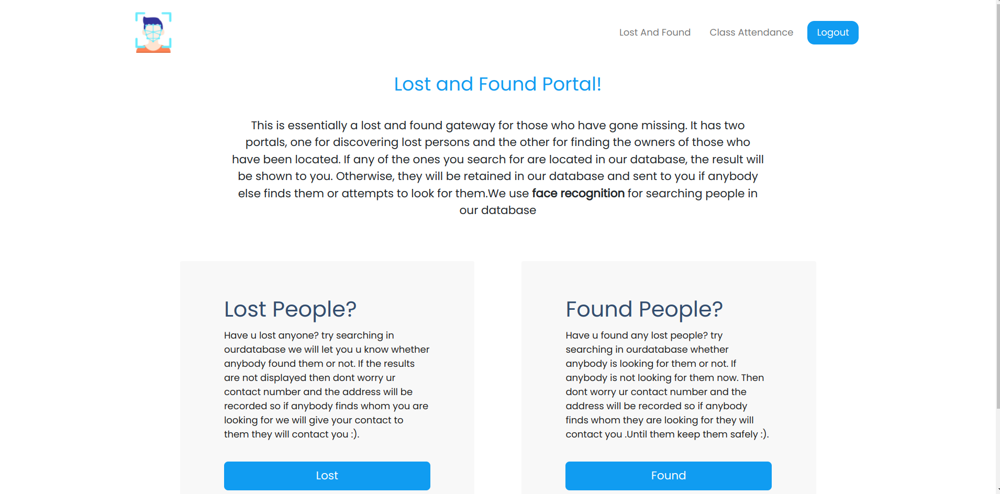
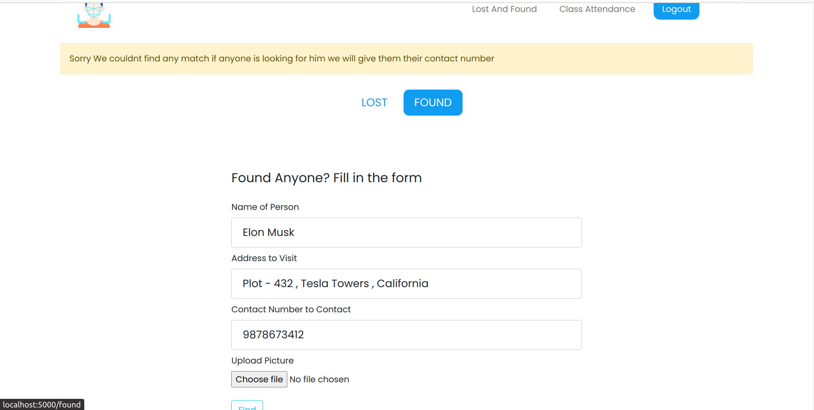
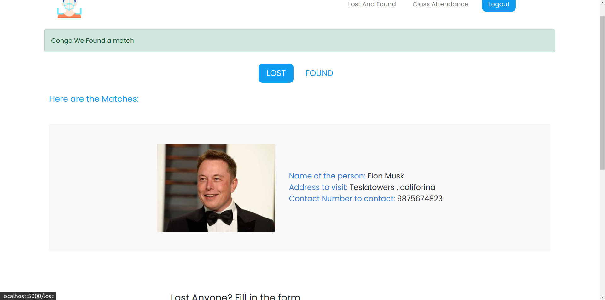
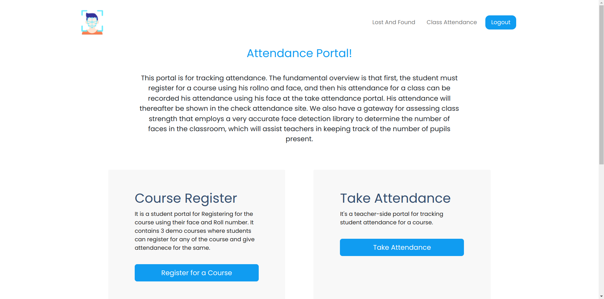
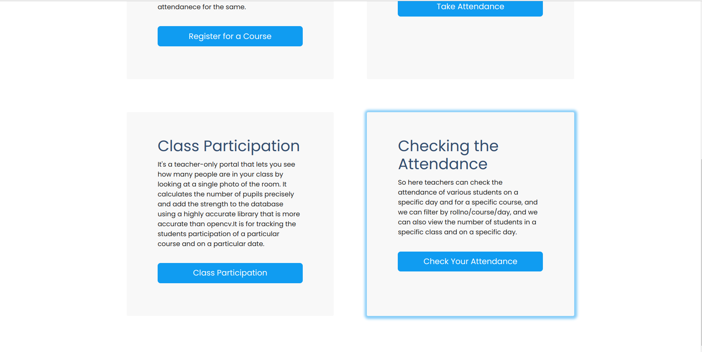
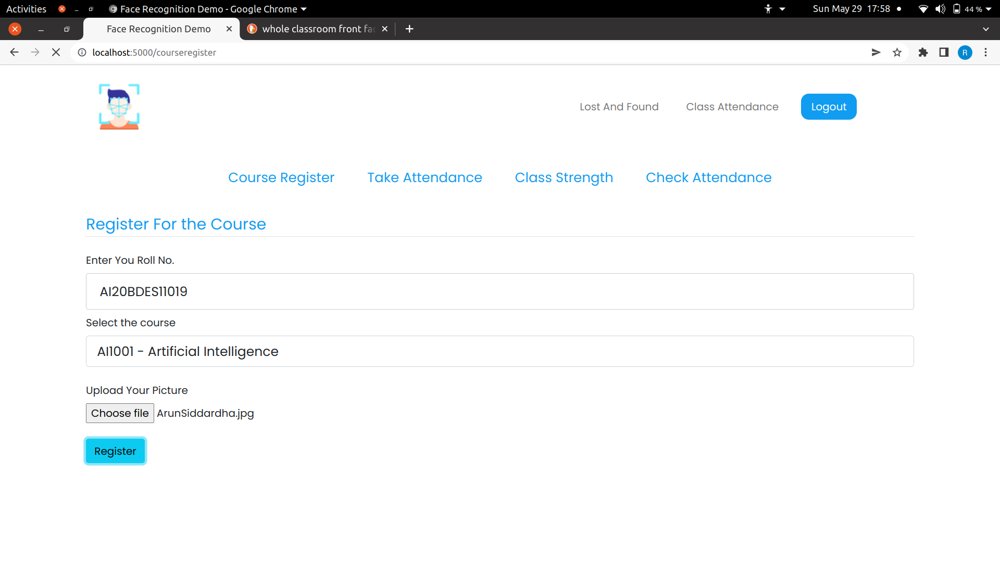
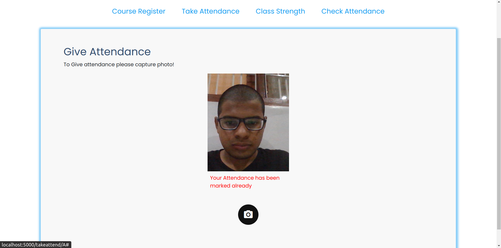
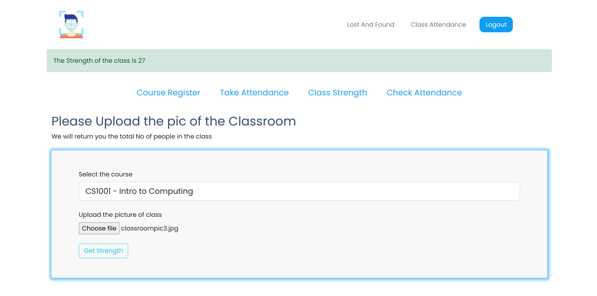

<div id="top"></div>

<!-- PROJECT LOGO -->
<br />
<div align="center">
 
  <h1 align="center">Face Recognition Demonstration</h1>

</div>


<!-- TABLE OF CONTENTS -->
<details>
  <summary>Table of Contents</summary>
  <ol>
    <li>
      <a href="#introduction">Introduction</a>
      <ul>
        <li><a href="#built-with">Built With</a></li>
      </ul>
    </li>
    <li>
      <a href="#how-to-use">How to Use</a>
    </li>
    <li>
      <a href="#key-features">Key Features</a>
      <ul>
        <li><a href="#login-and-register">Login and Register</a></li>
        <li><a href="#lost-and-found-portal">Lost and Found Portal</a></li>
        <li><a href="#tracking-attendance">Tracking Attendance</a></li>
      </ul>
    </li>
    <li>
      <a href="#agile-developement-technology">Agile Development Technology</a>
    <ul>
    <li ><a href="#sprint-1">Sprint 1</a>
    </li>
    <li ><a href="#sprint-2">Sprint 2</a>
    </li>
    <li ><a href="#sprint-3">Sprint 3</a>
    </li>
    <li ><a href="#sprint-4">Sprint 4</a>
    </li>
    </ul>
    </li>
  </ol>
</details>


<!-- ABOUT THE PROJECT -->
## Introduction

This project is built under microsoft engage mentorship program 2022.This Web app consists of three demonstrations of facial recognition
* Login Security
* Finding missing people
* Tracking Attendance

This Project is based upon computer vision applications and pre-built machine learning models.


<p align="right">(<a href="#top">back to top</a>)</p>


### Built With

This project is built using.

- Python : Server Side  Framework
- Flask : Backend Framework
- SQLALchemy : Database
- DeepFace : Face Recognition
- RetinaFace : Face Detection 


<!-- GETTING STARTED -->
## How to use

- Install python version 3.8
```sh
  sudo apt-get install python3.8
  ```

- Clone this repository
```sh
  git clone https://github.com/ArunSiddardha/FaceRecognition_Engage2022.git
  ```
- Change the working directory
```sh
  cd FaceRecognition_Engage2022
  ```
- Create a python virtual environment in the working directory

```sh
    python3 -m venv myenv
```

- Activate the python Virtual environment

```sh
    source myenv/bin/activate
```
- Install all the required packages

```sh
    pip3 install -r requirements.txt
```

<<<<<<< HEAD
- Run the flask server
```sh
    python app.py 
```

=======
- Run the flask server (using anyone of the command)
```sh
    python app.py  or flask run 
```
       
>>>>>>> 014b5d6a7480feecdc4bce48cedc64b41c44b6e0
- Run the app on the browser
```sh
    http://localhost:5000/ or whatever port it gives 
```


<p align="right">(<a href="#top">back to top</a>)</p>


## Key Features

### Login and Register
- Registration using users face & username
- Login using users face & usernmae

### Lost and Found Portal
- Lost Portal
    - users can upload the picture of lost people with their details of contact
    -  If the person is found in our databse then details to contact the person will be given to you
    - If the lost people were not found in the database then the picture gets saved in the lost people database so if anyone finds them using this portal then they will be given your contact detials
- Found Portal
    - Users can upload the picture of found people along with the details of contact
    - If the persons face is found in the database then it will give u the person to contact so that u can contact them
    - IF they are not found in the databse then the picture gets saved in our database so if anyone is looking for them using this portal they will be given the details of contact

### Tracking Attendance
- Course Registration
    - Students have to register for the course using their roll No and their face
- Taking Attendance
    - Teachers can take attendance using this portal and the attendance gets marked in the attendance sheet
- Classroom Strength
    - Teachers can upload the pic of their classroom of their course and get the strenght present on the class room on a particular day
- Checking Attendance
    - Teachers can check the class strength and the students attendance using this portal
## Images of the Web Application
### Home Page


<br>
<br>

### Lost And Found Portal


<br>
<br>
<br>

- If We/anyone Found Elon Musk Some where and upload the details of where to look for him along with contact number . We are now shown that until now no one is looking for elon musk if anyone tries looking for him afterwards then they will be given your contact details



<br>
<br>
<br>

- If any person is searching for elon musk now then since already user found  elon musk so their detials along their contact number will be provided to us as shown


<br>
<br>
<br>


### Class Attendance Portal




- Class registration


- Taking the Attendance


- Getting the class strength



## Agile Developement Technology
- I have adopted the Scrum methodology for developing the application
- I have Divided the 25 days of engage mentorship program into four sprints .Each sprint is consisted of 6 days period.

- Before every sprint , I used to set a target for that sprint period and work on it.

### Sprint 1

- I have given this entire sprint to choosing of the project statement and finding the required tech stack finding the required APIS, Lisiting out what is the scope of developement in the three problem statements.

- I have listed out all the requirements and features that can be integrated in these three kinds of webapps

- I have made a wireframes of the system designs and the UI design for the same

- So finally after getting all the suggestions from my fellow friends and seniors I thought to go with the problem statement 1. Demonstrations of the application of the face recognition technology

### Sprint 2

- Now that i have got my mentor assigned I havegot inputs from the mentor on how to proceed with the project and what features I might integrate with it.


- So in this sprint, I have mainly focused on the backend system design and the APIs that I have to create 
and the backend logic that I have to write with the tech stack im using.  

- I have included all the mandatory features and created the APIs for the same and written backend logic for the same.

- The I have tested each and every feature and I have commited the feature to the git if and only if it is working 

- I have spent many hours debugging code and writing the code in this sprint

### Sprint 3

- In this sprint I have mainly focused on the UI/UX part

- I have built a design prototype of hte UI and UX of the App

- I have taken inputs from my bdes friends for integrating the best and simple UI to app

- The UI of the webapp looks so pleasing and so simple

- I have done continuous UI/UX testing in this face.And I have worked on its adoption for various browsers and of various screen sizes

-  And I have added all the additional features in this face to the app

### Sprint 4

- This was the last sprint in my development phase. I was close to delivery date

- I took the feedback from friends and others on the UI and UX of the product .Then imporved it to a great extent

- I have run my application in my friends laptops and checked whether it is working fine and did so many development tests for its reponse times

- And I have cleared many of the small bugs that were present in the code and then made it perfect

<<<<<<< HEAD

=======
>>>>>>> 014b5d6a7480feecdc4bce48cedc64b41c44b6e0


<p align="right">(<a href="#top">back to top</a>)</p>
